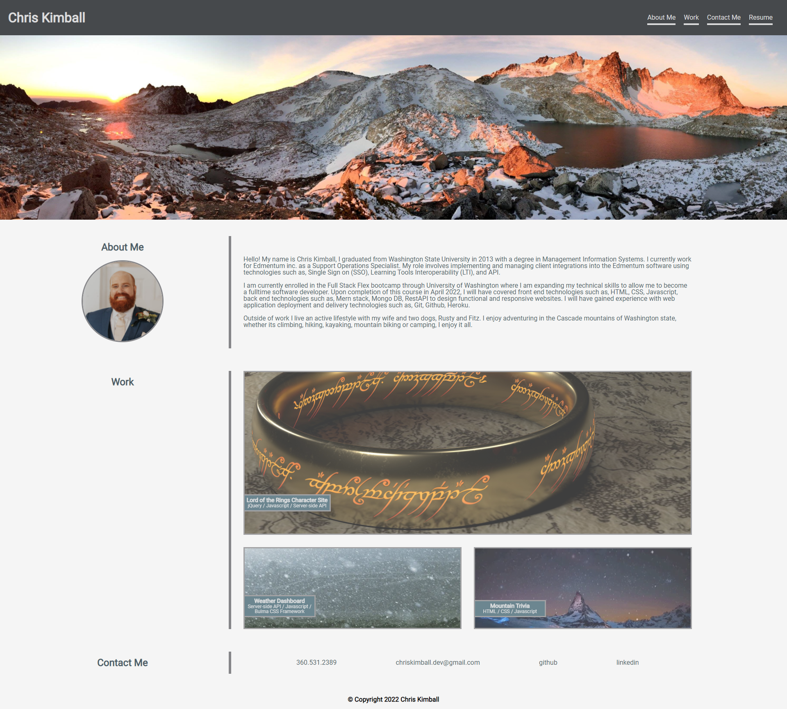
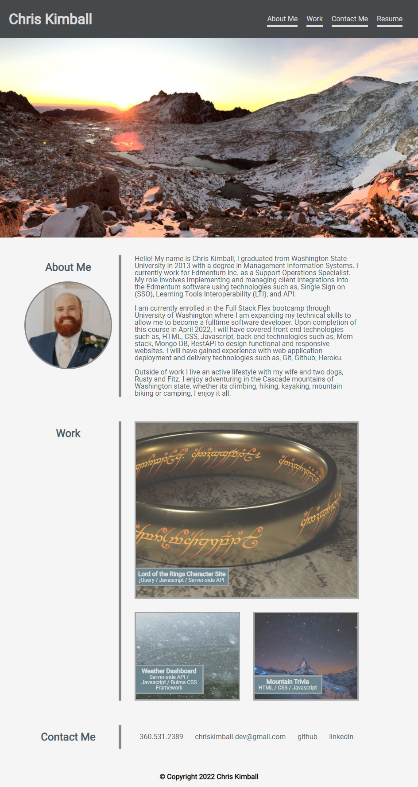
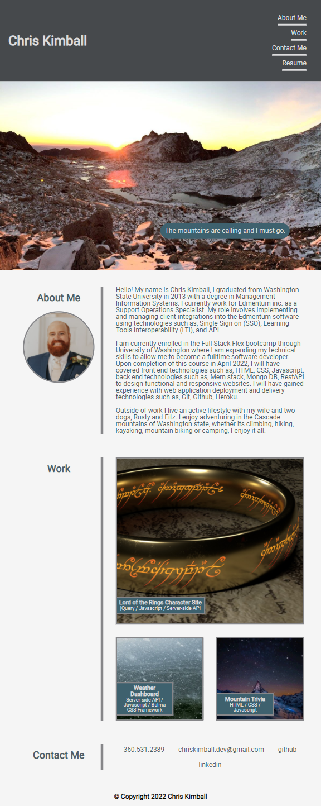
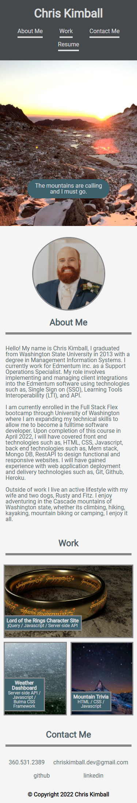

# Professional Portfolio - Chris Kimball

## Contributor - Chris Kimball

### Description
---------------
The following project is a professional portfolio for Chris Kimball. 
This portfolio is designed to show potential employers the skills and talents of Chris Kimball to fill a part-time or full-time position as a web developer.  

This is version 1.0 of Chris' portfolio, currently there are no deployed project examples to provide so placeholder projects have been inserted into the webpage for the time being.
The portfolio projects will be updated as Chris develops and deploys new projects through the course of his Full Stack Flex Bootcamp.

Upon launching the webpage users will be presented with navigation bar at the top of the page, with navigational links to three sections of the portfolio, 'About me', 'Work', and 'Contact Me.'
If the user hovers their cursor over the navigation links, the links will pop out to indicating the link that would be selected if clicked.

Below the header and navigation bar, the user is presented with a banner image of a mountain landscape (photo captured by Chris Kimball), and will be presented with a message if their cursor is hovered over the banner image.

The main content area of the webpage contains the three sections with an about me section with a short bio on Chris Kimball and a picture next to it in the heading area. Below the about me section in the work section there are examples of deployed projects. When a user hovers their cursor over a particular project image it will responsively pop out and be highlighted. If the user chooses to click on the image they will be brought to the deployed project on a live webpage.

Below the work section is the contact me section, which contains contact information to Chris Kimball as well as links to Chris Kimball's Github and Linkedin pages. When a user hovers their cursor over any of the contact me links it will expand the selection to increase visiblity for the selected item.

This whole portfolio page has been designed with a wide variety of display resolutions and devices in mind. All of the elements will dynamically resize themselves if the browser window is scaled up or down, or if the user is visiting the page on a mobile device.

### Web addresses
---------------
*  [Deployed Website](https://chriskimball.github.io/crk-portfolio-19372/ "Portfolio of Chris Kimball")

*  [Github Repository](https://github.com/chriskimball/crk-portfolio-19372 "Github Repo")

### Installation
---------------
1. Clone this Git repository
2. Navigate to repository in local directory.
3. Open index.html on default web browser.

### Screenshots
---------------
#### PC display 1920 pixel width

#### PC display 944 pixel width

#### iPad display 768 pixel width

#### iPhone display 375 pixel width

### Image Credits
---------------
* https://unsplash.com/photos/0srr4lMWZLQ
* https://unsplash.com/photos/DEga33BYvmA
* https://unsplash.com/photos/edTjV76tRI4
* https://unsplash.com/photos/XCw5TCRcEbE
* https://unsplash.com/photos/iNVY0hQvgCE

### Copyright Info
---------------
© 2021 Chris Kimball